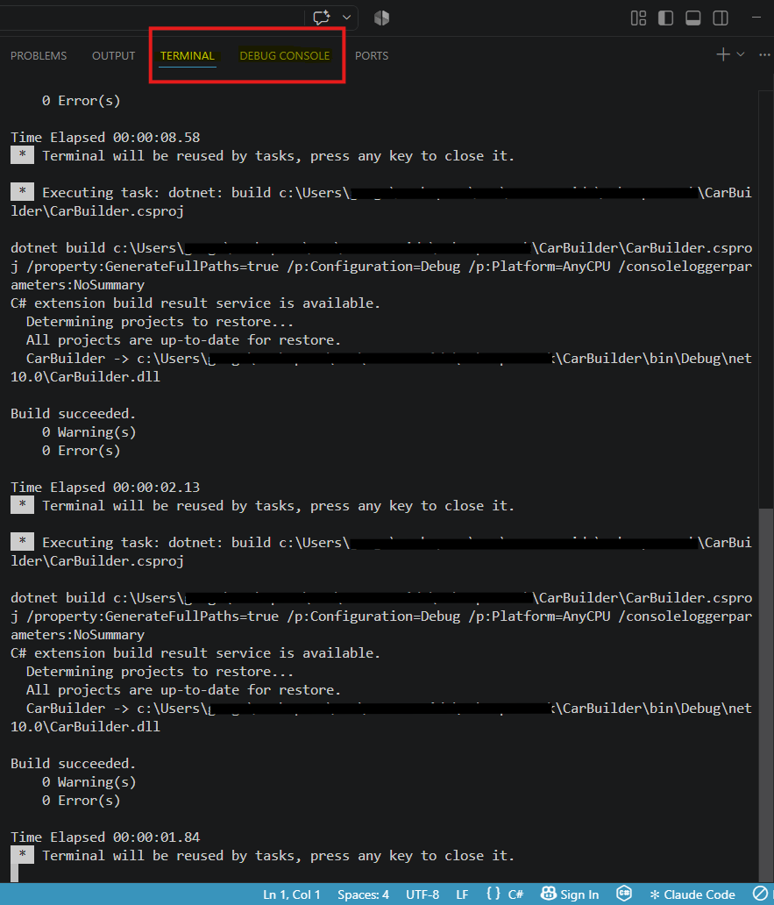

# Handy VS Code Settings

The two settings below both fix small but genuinely annoying VS Code debugging quirks. Both live in your **User Settings (JSON)**, not in any file inside your project, so each one is a **one-time-ever** fix: make it once, on this machine, and it applies to every project you open from now on, this book, the rest of this course, personal projects, all of it.

To get there: open the Command Palette (`Ctrl+Shift+P` on Windows/Linux, `Cmd+Shift+P` on Mac) and choose `Preferences: Open User Settings (JSON)`.

## Getting a consistent terminal (Windows only)

If you've been running your terminal commands in Git Bash so far, you may have noticed that starting the debugger sometimes opens a *different* terminal, one that behaves oddly, with commands that don't quite work the way you expect. That's PowerShell, Windows' own default shell. VS Code's build step (the one that runs behind the scenes before your API starts debugging) opens using whatever shell is set as your default, and on a fresh Windows install, that's PowerShell, not Git Bash, even if Git Bash is what you've been typing your other commands into all along.

PowerShell isn't broken, it's just a different shell with different syntax for paths, environment variables, and chaining commands. Bouncing between it and Git Bash mid-project is a common source of errors that have nothing to do with your code.

Fix it by adding this to your User Settings (JSON):
```json
"terminal.integrated.defaultProfile.windows": "Git Bash"
```
This makes every terminal VS Code opens, including the one behind the debugger's build step, use Git Bash instead. (Mac and Linux users don't need this, VS Code's default shell there is already Bash or zsh.)

> :bulb: One caveat, for the curious: this same setting also controls what shell VS Code's Test Explorer feature uses to run automated tests, and there's a known bug where Git Bash as the default breaks Test Explorer on Windows. Nothing in this course uses Test Explorer, so it's not a concern here, just something to know if you reach for that feature in a personal project down the road.

## Quieting the Debug Console

When you run your API with `dotnet watch run`, everything it prints shows up right in the terminal you typed that command into. When you run it through the VS Code debugger instead, that output goes somewhere else entirely: the `DEBUG CONSOLE` tab, next to `TERMINAL` at the bottom of VS Code. It's easy to miss the first few times, VS Code doesn't always switch you over to it automatically, so you can be staring at an empty `TERMINAL` tab (or the build-step terminal from the section above) and think nothing happened.

The `TERMINAL` tab (circled below) is where the debugger's build step reports in, `dotnet: build`, succeeded or failed, warnings, errors. `DEBUG CONSOLE` sits right next to it, and that's where your actual running API reports in once the build succeeds and it starts up.



This matters for more than curiosity. The host address lines that tell you what port your API is running on only show up in the Debug Console once you're debugging. Later on, once you start working with Entity Framework, the actual SQL statements EF generates behind the scenes get logged there too, even though you never typed a line of SQL yourself. Getting in the habit of checking the Debug Console now pays off later.

The first time you open it, though, you might see a wall of yellow text like:
```
Loaded 'System.Private.CoreLib.dll'. Symbols loaded.
Loaded 'System.Runtime.dll'. Skipped loading symbols.
Loaded 'Microsoft.AspNetCore.dll'. Skipped loading symbols.
```
repeated for every single assembly your program loads on startup, often over a hundred lines. This is the debugger reporting on every piece of compiled code it's attaching to as your program starts, useful if you're troubleshooting the debugger itself, but almost never useful for troubleshooting your own code.

A common guess is that "Just My Code" controls this, since it sounds related. It doesn't, "Just My Code" only affects whether the debugger *steps into* framework code while you're stepping through your program, it has nothing to do with what gets printed to the console.

The setting that actually controls it is called `moduleLoad`, one of a small family of logging settings VS Code's C# debugger supports:
- `moduleLoad`, the yellow module load spam above
- `programOutput`, your actual program's console output (the host addresses, your own `Console.WriteLine` calls, EF's SQL later on), you want to leave this one on
- `exceptions`, logs details when an exception is thrown
- `diagnosticsLog`, advanced output meant for troubleshooting the debugger itself, not your code

Turn off all that yellow text by adding this to the same User Settings (JSON) file:
```json
"csharp.debug.logging": {
    "moduleLoad": false
}
```
Notice this is a plain **setting**, not a launch configuration. You might expect an option like this to live in a `launch.json` file, but C# Dev Kit's "dynamic configuration" approach (the one you're already using, see [Honey Rae's exercise 1](./honeyrae-01-web-api-setup.md) and [Honey Rae's exercise 2](./honeyrae-02-testing-web-api.md)) intentionally skips creating that file. `settings.json` is a different kind of file, and this option happens to live there too, so you don't need to create a `launch.json` or a `.vscode` folder just for this.

If you're curious what else lives under `csharp.debug`, the [official VS Code C# debugger settings documentation](https://code.visualstudio.com/docs/csharp/debugger-settings) covers all of it, including `console` (which controls whether output goes to the Debug Console or the integrated Terminal in the first place).
