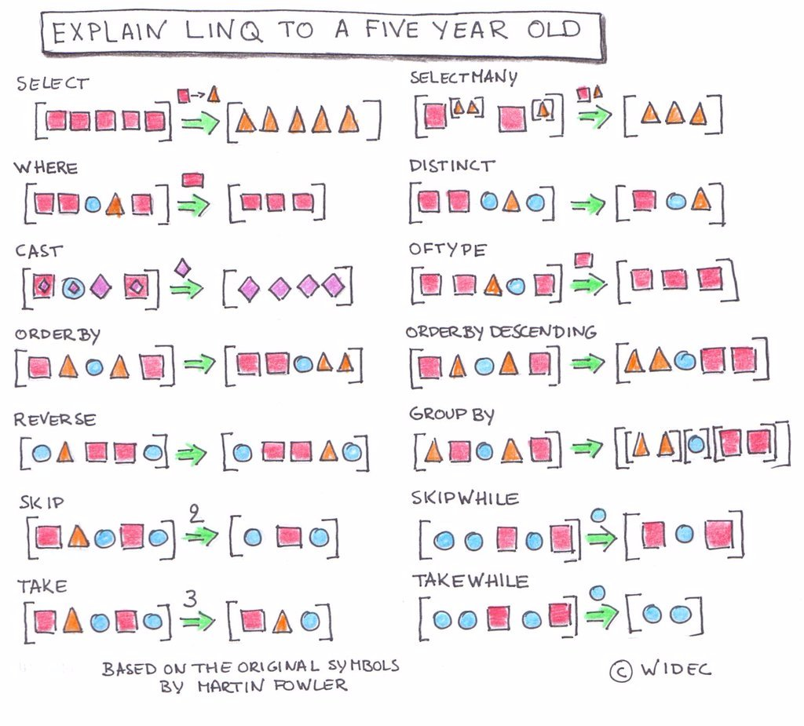

# :tv: Advanced LINQ: Nineties TV
You've been using LINQ since Book 1, and `OrderBy` back in [Get reservations](./creekriver-07-get-reservations.md) is the newest method you've picked up here in Book 3. If any of the basics feel rusty, the [LINQ Cheatsheet](../../book-1-foundations/chapters/resource-09-linq.md) covers `Where`, `Select`, `First`/`FirstOrDefault`, `Any`/`All`, `Count`, `OrderBy`/`OrderByDescending`, and the math methods (`Sum`, `Average`, `Min`, `Max`). This chapter isn't going to re-teach those, it covers a few more methods worth knowing, then points you at a much bigger set of practice problems than the short drills you've already done.

## A Few More Methods

### Skip and Take
These two are handy for paging through a large collection without writing the loop yourself.

```csharp
List<Person> skipFirstFive = people.Skip(5).ToList();
List<Person> firstThree = people.Take(3).ToList();
```

`Skip` throws away a given number of items from the front of the collection and returns the rest. `Take` does the opposite, it returns only the given number of items from the front and throws away the rest. Neither one has a real JavaScript array equivalent.

### Contains
Checks whether a collection already has a particular value in it.

```csharp
List<int> ages = people.Select(p => p.Age).ToList();
bool hasFortyTwo = ages.Contains(42);
```

This is the LINQ version of JavaScript's `includes()`.

## Why Do I Need `ToList()` Everywhere?
You've probably noticed that most LINQ method chains end with `.ToList()`, and wondered why. In JavaScript, array methods like `map()` and `filter()` return an array, so you might expect `Select()` and `Where()` to return a `List` the same way. They don't.

Methods like `Where` and `Select` actually return an `IEnumerable<T>`, an interface implemented by `List` and just about every other collection type in .NET, which is why LINQ methods are written against it instead of against `List` specifically: it lets the same methods work no matter what kind of collection you started with. You don't need to understand `IEnumerable` in any depth to get the benefit of LINQ, though. The practical rule is simple: **when you need an actual `List`, call `.ToList()`.**

## LINQ's Query Syntax
The names of LINQ's methods aren't an accident, `Where`, `Select`, and `OrderBy` were deliberately chosen to echo SQL, since LINQ's designers figured developers would find it easier to learn if it looked familiar. They didn't stop there, though, LINQ also has a second, completely different syntax meant to look even more like SQL, usually called the _query syntax_:

```csharp
List<string> twentySomethings = (
        from p in people
        where p.Age >= 20 && p.Age < 30
        select $"{p.FirstName} {p.LastName}"
    ).ToList();
```

This course sticks to the _method syntax_ you've been using all along (`people.Where(...).Select(...)`), but you'll run into the query syntax online and possibly on the job, so it's worth being able to recognize it.

## Practice: 90s TV
The short drills you already did in Book 1 only scratch the surface. For a much bigger set of LINQ practice problems, working against a dataset of 90s TV shows, clone this repo:

https://github.com/nashville-software-school/NinetiesTV

> **NOTE:** Create your own repo and change the remote origin before pushing your code to GitHub, the same way you would for any other practice repo.

## Additional Resources

### Visualizing LINQ
Here's a visual reference for several LINQ methods, including a few beyond what's covered here or in the cheatsheet.



### Intro to LINQ Video
https://www.youtube.com/watch?v=p5myHVOtmiU

### 101 LINQ Samples
https://docs.microsoft.com/en-us/samples/dotnet/try-samples/101-linq-samples/
