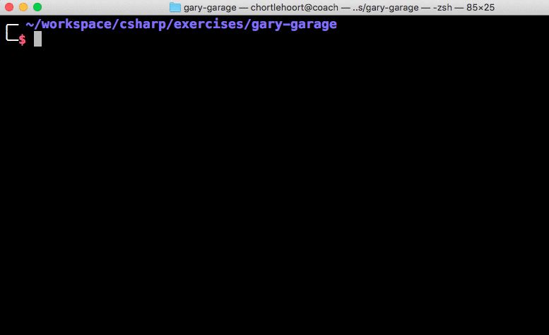
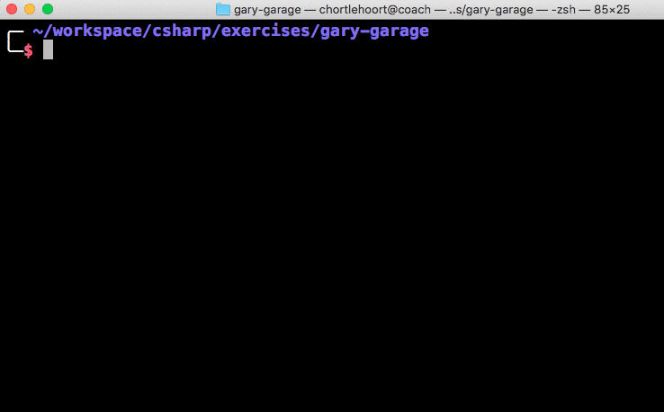
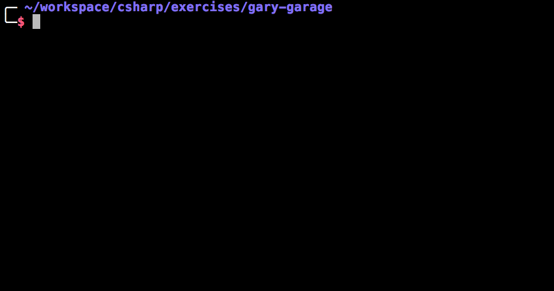
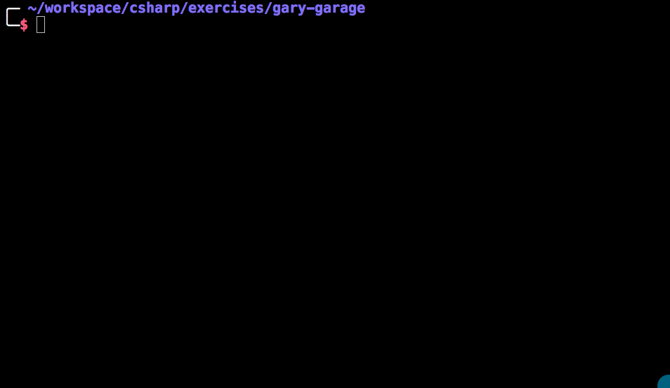

# :tent: Class-Based Inheritance
Back in [Creating the database](./creekriver-02-db-context.md), you saw `: DbContext` after `CreekRiverDbContext` and learned that this is how _inheritance_ is indicated in C#, one class inheriting all of the properties, fields, and methods of another. That chapter only asked you to recognize inheritance when you saw it, though. This chapter is where you build that relationship yourself, using it to reduce duplicated code when several types in a program share the same properties and/or methods. It's one of the mechanisms C# uses to introduce polymorphism into a program, and it's likely to come up in interviews, so being able to describe it in your own words is worth the practice.

## Creek River's Vehicle Fleet
Running a campground takes more than just campsites, Creek River also keeps a small fleet of vehicles on hand for day-to-day operations. We'll represent each _type_ of vehicle using its own C# class.

Create a new console project in your practice directory called `CreekRiverFleet`.

> `GolfCart.cs`
```csharp
namespace CreekRiverFleet;

public class GolfCart  // Electric cart the rangers use to patrol the grounds
{
    public double BatteryKWh { get; set; }
    public string MainColor { get; set; }
    public int MaximumOccupancy { get; set; }

    public void ChargeBattery()
    {
        // method definition omitted
    }
}
```

> `UtilityCart.cs`
```csharp
namespace CreekRiverFleet;

public class UtilityCart  // Electric cart the grounds crew uses to haul firewood and supplies
{
    public double BatteryKWh { get; set; }
    public string MainColor { get; set; }
    public int MaximumOccupancy { get; set; }

    public void ChargeBattery()
    {
        // method definition omitted
    }
}
```

> `MaintenanceTruck.cs`
```csharp
namespace CreekRiverFleet;

public class MaintenanceTruck  // Gas powered truck for hauling and repairs
{
    public double FuelCapacity { get; set; }
    public string MainColor { get; set; }
    public int MaximumOccupancy { get; set; }

    public void RefuelTank()
    {
        // method definition omitted
    }
}
```

> `Tractor.cs`
```csharp
namespace CreekRiverFleet;

public class Tractor  // Gas powered tractor for mowing and grounds work
{
    public double FuelCapacity { get; set; }
    public string MainColor { get; set; }
    public int MaximumOccupancy { get; set; }

    public void RefuelTank()
    {
        // method definition omitted
    }
}
```

When evaluating a system for opportunities to use inheritance, look for classes that have identical properties or methods. Do you see any properties that each of the four fleet classes above have in common? They all share `MainColor` and `MaximumOccupancy`.

As Creek River adds more vehicle types to its fleet, it would get tedious to keep defining those two properties in every class, and it raises the odds of a bug: if `MainColor` ever needed to be renamed to `BaseColor`, every one of these classes would need to be updated, and it's easy to miss one.

## The Vehicle Class
Since all four types are vehicles, a good name for a more general type here is `Vehicle`.

> `Vehicle.cs`
```csharp
namespace CreekRiverFleet;

public class Vehicle
{
    public string MainColor { get; set; }
    public int MaximumOccupancy { get; set; }
}
```

Each of the other, more specific, types can now inherit from it. A colon between the class name and the base class name is how C# expresses that:

> `GolfCart.cs`
```csharp
namespace CreekRiverFleet;

public class GolfCart : Vehicle
{
    public double BatteryKWh { get; set; }

    public void ChargeBattery()
    {
        // method definition omitted
    }
}
```

Now any instance of `GolfCart` automatically has both `MainColor` and `MaximumOccupancy`, the exact same "is-a" relationship you already saw with `CreekRiverDbContext : DbContext`, just with your own types this time. When two classes are involved in an inheritance relationship, the more general type (`Vehicle`) is called the _base class_ or _parent class_, and the more specific one (`GolfCart`) is the _subclass_ or _child class_.

## Overriding Parent Behavior
You can safely assume every vehicle in the fleet can be driven, so implement a `Drive()` method on `Vehicle`:

> `Vehicle.cs`
```csharp
namespace CreekRiverFleet;

public class Vehicle
{
    public string MainColor { get; set; }
    public int MaximumOccupancy { get; set; }

    public void Drive()
    {
        Console.WriteLine("Vrooom!");
    }
}
```

Now every vehicle in the fleet can be driven, but they'll all currently make the exact same sound, which doesn't make much sense, a tractor doesn't sound like a golf cart.

> `Program.cs`
```csharp
using CreekRiverFleet;

GolfCart rangerCart = new GolfCart();
UtilityCart haulingCart = new UtilityCart();
MaintenanceTruck truck = new MaintenanceTruck();

rangerCart.Drive();
haulingCart.Drive();
truck.Drive();
```



To give each vehicle its own sound, two things need to happen:

1. Mark the `Drive()` method as `virtual` on the base class:
    ```csharp
    namespace CreekRiverFleet;

    public class Vehicle
    {
        public string MainColor { get; set; }
        public int MaximumOccupancy { get; set; }

        public virtual void Drive()
        {
            Console.WriteLine("Vrooom!");
        }
    }
    ```
1. Override the method in the child class:
    ```csharp
    namespace CreekRiverFleet;

    public class Tractor : Vehicle
    {
        public double FuelCapacity { get; set; }

        public void RefuelTank()
        {
            // method definition omitted
        }

        public override void Drive()
        {
            Console.WriteLine("Chugga-chugga-chug!");
        }
    }
    ```

Now running the program again with a `Tractor` included, it makes a different sound than the rest of the fleet:



## Practice: Custom Colors and Sounds
1. Move all common properties in your fleet classes to a new `Vehicle` class.
1. Create an instance of each vehicle.
1. Define a different value for each vehicle's properties.
1. Create a `Drive()` method in the `Vehicle` class.
1. Override the `Drive()` method in all the other vehicle classes. Include the vehicle's color in the message (e.g. "The green Tractor drives past. Chugga-chugga-chug!").
    
1. Create a `Turn(string direction)` method and a `Stop()` method on `Vehicle`. Define a basic implementation of each.
1. Override all three of those methods on some of the vehicles. For example, the `Stop()` method for the tractor might output "The green Tractor rolls to a stop at the edge of the field."
1. Make your vehicle instances perform all three behaviors.



## Practice: Shooting Dice
For more inheritance practice, follow the instructions in this repo:

https://github.com/nashville-software-school/ShootingDice

Up Next: [Loncotes County Library](./loncotes-01-setup.md)
