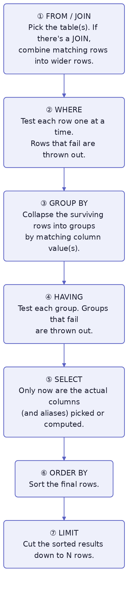

# SQL

A quick syntax reference for the SQL you'll write in this book — PostgreSQL specifically, though almost all of this transfers directly to other relational databases.

## Order of Operations

SQL is *written* in one order, but the database evaluates it in a different order internally:

| You write it in this order | It actually runs in this order |
|---|---|
| `SELECT` | `FROM` / `JOIN` |
| `FROM` / `JOIN` | `WHERE` |
| `WHERE` | `GROUP BY` |
| `GROUP BY` | `HAVING` |
| `HAVING` | `SELECT` |
| `ORDER BY` | `ORDER BY` |
| `LIMIT` | `LIMIT` |

Each stage hands its result to the next as a working set of rows — filtering, grouping, or reshaping it along the way:



**① `FROM` / `JOIN` runs first.** The database decides which table(s) the data comes from. If there's a `JOIN`, it builds a combined set of rows by matching rows across tables on the `ON` condition. Nothing has been filtered yet — this is the raw working set everything else operates on.

**② `WHERE` runs next, one row at a time.** Each row from step ① is tested against the `WHERE` condition; failing rows are discarded. Because grouping hasn't happened yet, `WHERE` has no concept of a "group" — this is exactly why you can't put an aggregate function like `COUNT(*)` in a `WHERE` clause. There's no group for it to count yet.

**③ `GROUP BY` runs on whatever rows survived `WHERE`.** Matching rows collapse into groups, one group per distinct value (or combination of values) in the `GROUP BY` column(s). This is also the point where aggregate functions (`COUNT`, `SUM`, `MAX`, etc.) actually get computed — one result per group.

**④ `HAVING` runs after groups exist**, so it can test conditions on those groups — including on the aggregate values computed in step ③. Think of `HAVING` as `WHERE`'s counterpart, but for groups instead of individual rows.

**⑤ `SELECT` runs after all the filtering and grouping is done.** Only now does the database figure out which columns — or computed expressions and aliases — to actually return. This is why a `WHERE`, `GROUP BY`, or `HAVING` clause can't reference an alias you defined in `SELECT`: none of them have run `SELECT` yet at the point they execute.

**⑥ `ORDER BY` runs after `SELECT`,** so unlike the clauses above it, it *can* reference a `SELECT` alias — that column already exists by this point.

**⑦ `LIMIT` runs last,** cutting the already-sorted result down to the requested number of rows. This is also why `LIMIT` only reliably gets you a "top N" when it's paired with `ORDER BY` — without a defined sort, "the first N rows" isn't a meaningful guarantee.

<br clear="left">

## SELECT

```sql
SELECT * FROM Genre;                 -- every column
SELECT Name FROM Genre;              -- just one column
SELECT Name, Id FROM Genre;          -- specific columns
SELECT DISTINCT Name FROM Genre;     -- no duplicate values
```

## WHERE

```sql
SELECT * FROM Artist WHERE YearEstablished > 1970;
SELECT * FROM Artist WHERE YearEstablished > 1970 AND ArtistName = 'Rush';
SELECT * FROM Artist WHERE YearEstablished > 1970 OR ArtistName = 'Rush';
SELECT * FROM Song WHERE GenreId IS NULL;       -- no value
SELECT * FROM Song WHERE GenreId IS NOT NULL;
```

## ORDER BY / LIMIT

```sql
SELECT * FROM Artist ORDER BY ArtistName;          -- ascending (default)
SELECT * FROM Artist ORDER BY ArtistName DESC;      -- descending
SELECT * FROM Artist ORDER BY ArtistName LIMIT 5;   -- top 5 only
```

## JOIN

```sql
-- INNER JOIN: only rows that match in both tables
SELECT s.Title, a.ArtistName
FROM Song s
JOIN Artist a ON s.ArtistId = a.Id;

-- LEFT JOIN: every row from the left table, matched data if it exists (NULL if not)
SELECT a.Title, s.Title
FROM Album a
LEFT JOIN Song s ON s.AlbumId = a.Id;
```

Direction matters — `FROM Album LEFT JOIN Song` keeps every album, even ones with no songs. `FROM Song LEFT JOIN Album` keeps every song, even one that (hypothetically) has no album.

## GROUP BY / HAVING

```sql
-- count of songs per album
SELECT AlbumId, COUNT(*) AS SongCount
FROM Song
GROUP BY AlbumId;

-- only albums with more than 5 songs
SELECT AlbumId, COUNT(*) AS SongCount
FROM Song
GROUP BY AlbumId
HAVING COUNT(*) > 5;
```

`WHERE` can't filter on an aggregate like `COUNT(*)`, because `WHERE` runs before grouping happens. `HAVING` runs after `GROUP BY`, so it can.

## Aggregate Functions

```sql
SELECT COUNT(*) FROM Song;             -- number of rows
SELECT SUM(SongLength) FROM Song;      -- total
SELECT AVG(SongLength) FROM Song;      -- average
SELECT MIN(SongLength) FROM Song;      -- smallest
SELECT MAX(SongLength) FROM Song;      -- largest
```

## INSERT

```sql
INSERT INTO Genre (Name) VALUES ('Soul');
INSERT INTO Artist (ArtistName, YearEstablished) VALUES ('Rush', 1968);
```

## UPDATE

```sql
UPDATE Artist SET YearEstablished = 1969 WHERE Id = 3;
```

## DELETE

```sql
DELETE FROM Artist WHERE Id = 3;
```

## CREATE TABLE

```sql
CREATE TABLE Genre (
    Id INTEGER PRIMARY KEY GENERATED ALWAYS AS IDENTITY,
    Name TEXT NOT NULL
);

CREATE TABLE Album (
    Id INTEGER PRIMARY KEY GENERATED ALWAYS AS IDENTITY,
    Title TEXT NOT NULL,
    ArtistId INTEGER NOT NULL REFERENCES Artist (Id),  -- foreign key, required
    GenreId INTEGER REFERENCES Genre (Id)               -- foreign key, optional
);
```

`GENERATED ALWAYS AS IDENTITY` auto-increments the primary key for you. `REFERENCES` creates a foreign key constraint — the row it points to has to exist. Leaving `NOT NULL` off a foreign key column makes that relationship optional.
